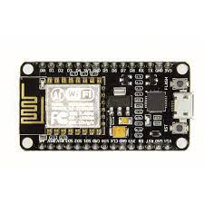
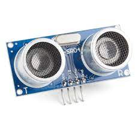
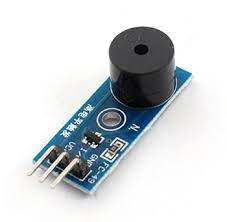

# TARP

## Introduction
Water is one of the fundamental needs of humans. 
Approx 30% of water requirement of a individual is water to inefficient 
distribution of water or due to human errors. 
12% of water reservoirs are completely dry and 65 % of them are below-normal level.
Three-fourths of India’s rural families lack access to piped,drinkable water and rely on unsafe sources.
This is a small contribution to the large effort to solve water crisis.

## Problem Statement
Generally every house has underground and overhead tanks.
Water to underground tanks are supplied periodically and pumped to overhead tanks using electric motors.
This electric motors are inefficiently used resulting in higher power consumption and high maintenance cost.
Also there is no tracking of water usage in a lot of homes, other than a monthly water bill. 
Adding to this, there is a lack of data generated on water consumption for study or
data analysis on some of the usage patterns and water consumption overall.
Having day to day water consumption data will  help us in analyzing the water usage 
patterns and also create awareness on water consumption at home level.

## Proposed Solution
To solve this problem we are coming up with this Water Level Indicator & Controller.
This will have an Automated water level controller and monitor.
And it will provide data collection at individual house or commercial place level.
 Can communicate with central server or home automation system using 
 wifi or bluetooth for various levels of data collection.

The working of our Water Level Indicator & Controller is as follows:
The sensor will be monitoring the level of water constantly.
And if in case the water level is less than threshold, then the power of the motor pump is 
used to fill the tank till the maximum threshold limit of the tank is reached.
Moreover, whenever the water level has a large change we can generate alerts thereby 
preventing any overflow/wastage of water or other dangerous situation.
Finally, constantly the water level is displayed on monitor.

The Ground tank detects any water coming in from an external source and pumps it 
into the Overhead Tank for further usage.
The personalized data we collect by monitoring the day to day usage of water 
can be used to make patterns of water consumption.
This can help us to identify any irregular trends of water usage and thereby
control it and alert the user if needed.
This data can also help the water providers to be more efficient with their
timings as to when they need to provide water.

## Uniqueness
Automated solution.
Not limited to home usage.
By changing the sensors and tinkering software, can be implemented in 
wide domains such as smart agriculture, smart water distribution, chemical industries.
Saves money and conserves energy.
Leak and malfunction detection.
Data collection.

## Milestones
- [x] Concept and Design
- [x] Components and assembly
- [x] Circuit design
- [x] Water level moniter
- [x] Data Collection
- [x] Vizualization
- [ ] Water level controller
- [ ] Integration
- [ ] Documentation
## Current Status
Deisgn and concept is finalized through brainstroming.  
Components have been purchased.  
Blynk server integration and data collection from 2 house for 14 days done.  
Dashboard for the collected data generated.

## Components

1.Microcontroller: nodemcu esp8266.  
  

2.Depth-sensor: ultrasonic sensors.  
  

3.IOT: Blynk Free Tier Server and Google drive  
[Blynk](https://blynk.io/)    
  
[dataset]()    
    

4.Relay(5v/based on the motor running voltage).    
  
5.Buzzer.    
    

## Block Diagram(Design)

## Team Members

- Lakshmi Sairam Kakarla
- S Abishek Sriram 
